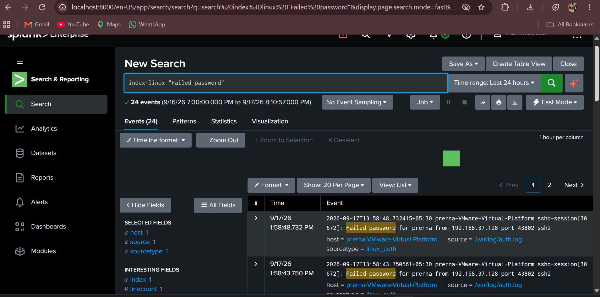
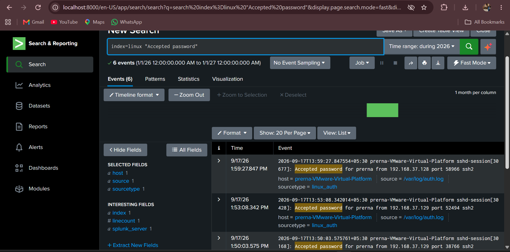
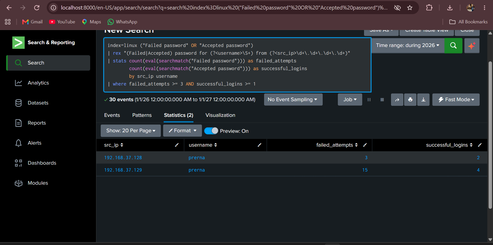

# SSH Brute-Force Detection using Splunk

## Overview

This project demonstrates the detection and analysis of repeated SSH authentication attempts using Splunk.

SSH login attempts were generated from Kali Linux against an Ubuntu system. The resulting authentication logs were collected and monitored in Splunk to identify repeated failed login activity.

## Technologies Used

* Kali Linux
* Ubuntu Linux
* SSH
* Splunk
* Splunk Universal Forwarder

## Workflow

```text
Kali Linux
    ↓
SSH Login Attempts
    ↓
Ubuntu Authentication Logs
    ↓
Splunk
    ↓
Log Analysis
    ↓
Brute-Force Pattern Detection
```

## Implementation

* Generated failed SSH login attempts from Kali Linux.
* Performed repeated authentication attempts to simulate brute-force activity.
* Collected Ubuntu SSH authentication logs in Splunk.
* Analyzed repeated login attempts and source information.

## Screenshots

### 1. Failed SSH Login



### 2. Authentication Logs in Splunk



### 3. Brute-Force Analysis



## Key Learning

* Linux SSH authentication monitoring
* Splunk log analysis
* Identifying repeated failed login attempts
* Basic brute-force detection
* SOC alert investigation

